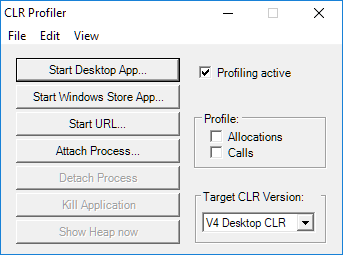
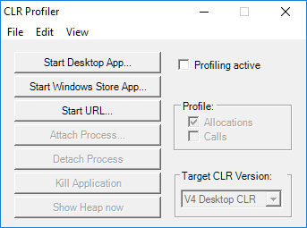
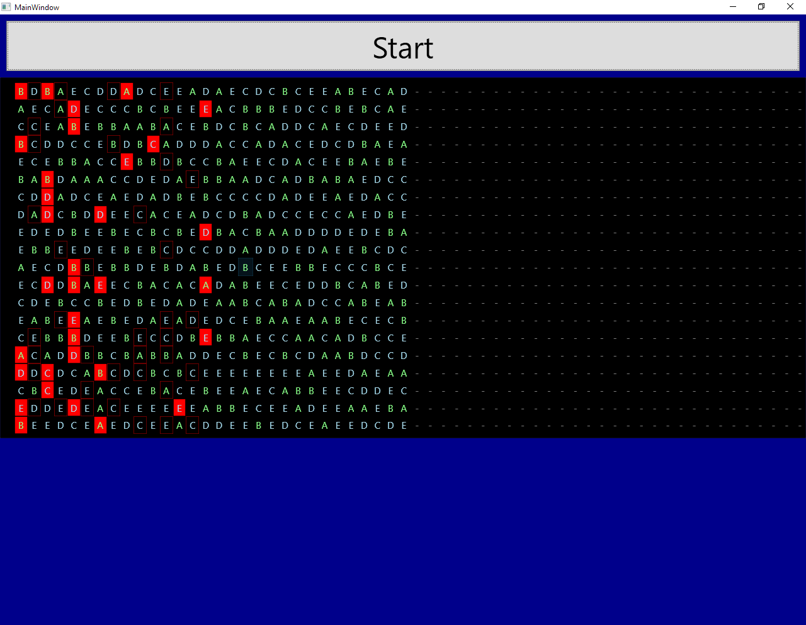
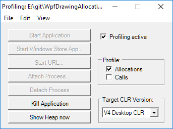
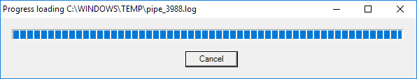
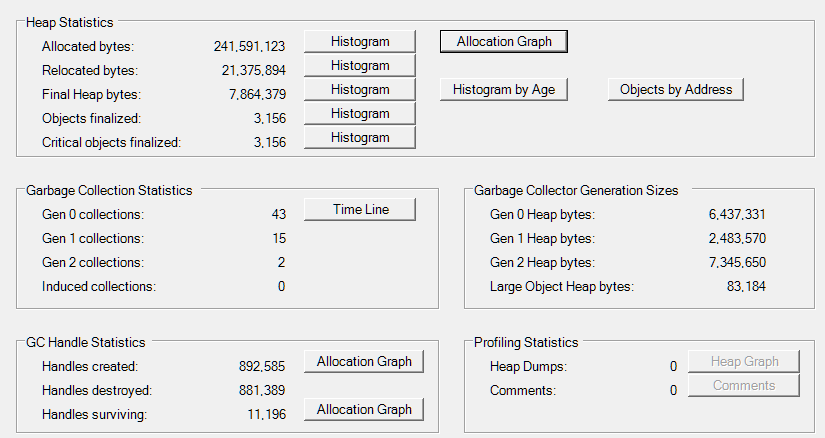
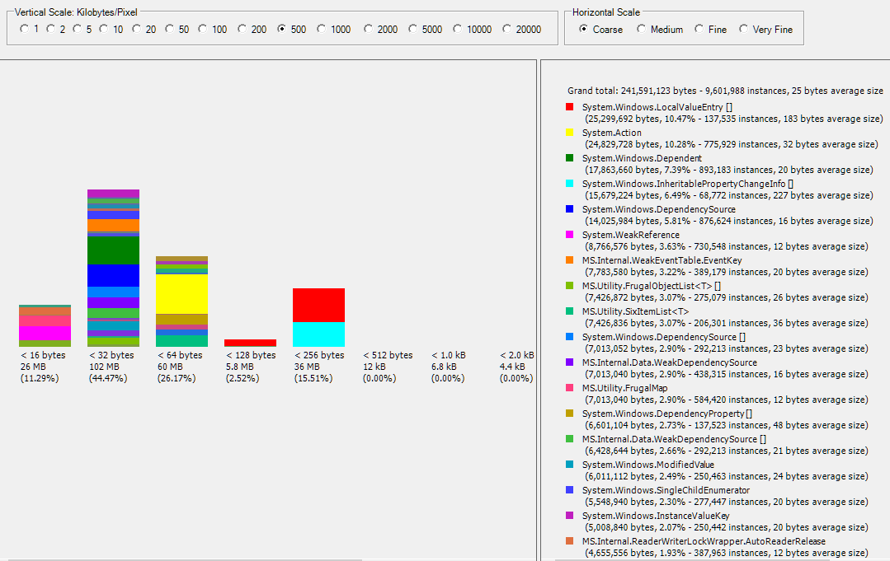

# WpfDrawingAllocations
Investigate and optimize WPF allocations for drawing.

## Profiling using CLRProfiler
 * Download [CLRProfiler](https://github.com/MicrosoftArchive/clrprofiler) 
   from [codeplex download](http://clrprofiler.codeplex.com/#) 
   (note this download will probably stop working soon).
 * Extract zip-archive someplace.
 * Start the 32-bit CLR profiler by running
```CLRProfiler45Binaries\32\CLRProfiler.exe``` showing:



 * Check `Allocations` and uncheck `Profiling active` (we do this to avoid profiling allocations made during startup):
 


 * Click `Start Desktop App...` and select one of the executables of this project 
   e.g. starting something like (this may take a little while to start):



 * Go back to the `CLRProfiler` window and check `Profiling active`:



 * Start the app WPF UI by clicking `Start` and wait for the app to 
   automatically exit after running for a little while. Note the app
   may become completely unresponsive due to the insane number of allocations
   and the profiler being attached. 

 * When app stops `CLRProfiler` will parse the log:



 * After parsing the summary result will be shown:



 * Click `Histogram` next to `Allocated bytes:` which will show:



 * From this one can see that this example has a very high number of 
   instances allocated during the short time frame 
   i.e. here in total ~9.6 million instances.
 
